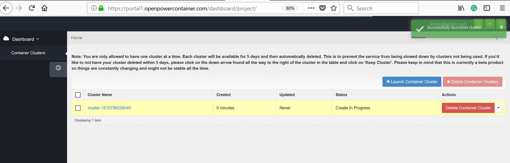

# Create a ICP cluster on OpenPOWER systems cloud 

Beta Service: Please note this is an experimental service and IBM provides no guarantees of availability or preservation of programs or data. 
Use at your own risk.

For IBMers there is a portal service to build ICP 2.1 & 1.2 version on OpenPOWER systems [here] (https://portal1.openpowercontainer.com/dashboard/auth/login)

## Prerequisites
The following tools are required. You need to add these command lines tools accessible from your PATH.
 - Install kubectl CLI
 - [Cmder](https://github.com/cmderdev/cmder) (for Windows environment, you can use Cmder where common Linux tools is included).
 
## Following steps shows how to create ICP Cluster on OpenPOWER systems and access from your workstation or laptop

 - Create your own cluster on OpenPOWER system cloud
 - Setup kubectl to access kubenetes cluster environment from your workstation or laptop
 - Setup service account token for kebectl
 - SSH to cluster environment from your workstation or laptop
 
	
### Create your own cluster on OpenPOWER system cloud

 - Login to portal service using your IBM account [here] (https://portal1.openpowercontainer.com/dashboard/auth/login)
 
 - Enter your IBMid
 
 - Page will be redirected to W3id for authendication if your IBMid associated with IBM W3id
 
 - Click on "Launch Container Cluster" icon on the right side of the dashboard.
 
 - Pick your ICP version and cluster environment and click on "Launch"
 
 - Your cluster will be successfully launched with status as "Create in Progress". Wait for few minitues and refresh your page to see status as "Create Complete". 
   Click on cluster name to access details.
 
 - Cluster Overview tab will provides details about your new cluster and "Access Instructions" tab will guide you to setup kubectl and SSH access.
 
 
 - Click on console link provided in the access instrctions tab to get into the ICP console
 
 
 
### Setup kubectl to access kubenetes cluster environment from your workstation or laptop

 - On the ICP dashboard right top corner, click on "admin" icon to get "Configure client" 
 
 - To configure kubectl copy and paste in your terminal windows.
 
 as shown below
 
 to verify run "kubectl cluster-info" command
 
 
 ### Setup service account token for kebectl
 
 - Follow the instrctions on "Access instrctions" tab to setup service account token
   Cmder (preferable for windows) 
 
 as shown below
 
 Note: Use printf instead of echo to decode token and then pass the decoded value to configure as shown below
 
 to verify run "kubectl cluster-info" command
 
 
 ### SSH to cluster environment from your workstation or laptop
 
 - Follow the instrctions on "Access instrctions" tab to setup SSH session to cluster.
   Open Cmder (preferable for windows)
 
 as shown below
 
 